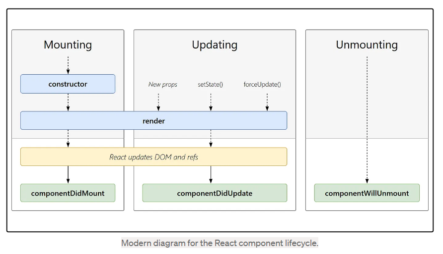

# Class Base Components

- Class Base Components Structure

        import React from "react";
        class UserClass extends React.Component {
        constructor(props) {
            super(props);
            console.log(props);

            this.state = {
            count: 100,
            FullName : "Aman Kumar Jha"
            };
        }

        render() {
            const { location, name } = this.props;

            const { FullName, count } = this.state;

            return (
            

                <h1>Count :{this.state.count}</h1>
                <h2>Name : {FullName}</h2>
                <h2>FullName : {this.props.FullName}</h2>
                <h2>Class : BCA</h2>
                <h3>Roll : 12</h3>
                <h4>Location : {location}</h4>
            

            );
        }
        }

- State In Class Base Components

  - State decleared under the constructor

          - constructor(props) {
          super(props);
          console.log(props);

          this.state = {
          count: 100,
          FullName : "Aman Kumar Jha"
          };

    }

  - How We Set the Value of State Variables..

        

        <h1>Count :{this.state.count}</h1>
        <button
          className="border-2 border-blue-700 bg-pink-400 text-gray-700"
          onClick={() => {
            this.setState({
              count: this.state.count + 1,
              FullName: this.state.FullName + " Purushottampur",
            });
          }}
        >
          Increase Count
        </button>

      

# Life Cycle of Class Base Components

- when the parent components see the classbase components when it render the constructor first, then the render method of class base components

- componentdidmount will work after render process 

- work flow

       - 1st parent constructor, 2nd  parent render method, 3rd child constructor, 4th child render method, 5th child componentdidmount, 6th parent componentdidmount

      - parent Constructor

            - parent Render

            - child1 constructor
            - Child1 render
            
            - child2 constructor
            - child2 render

          # Dom Updated in single batch
          - child1 componentsdidmount
          - child2 componentsdidmount

          - child1 componentdidUpdate
          - child2 componentdidUpdate
          
          // it called when disabling from the page
          - child1 componentWillMount
          - child2 componentWillMount

      - parent componentsdidmount
      - parent componentsdidUpdate

# What Componnent Did Mount Work:-
- ComponentsDidMount will use to do api call and fill the render Elements because
react work flow is as that it firstly render the element and then do api calls, so components did mount use to fill the render eleemnts..

# Api Fetching in Class Base Components
- fetch is done under the method componentDidMount

      async componentDidMount() {

      const data = await fetch("https://api.github.com/users/jhAman-9");

      const json = await data.json();

      console.log(json);

      this.setState({
        userInfo: json,
      });

      console.log(json);
    }

# Note
- react render the components then do api calls

- Mountin means showing to the UI
- UnMounting Means disabling from the UI

- react first update the dom with the dummy or initilized data and then the api call after that the state variable get updated and render method call once again

- UseEffect is not equavalent to componentsDidMount()

    # UseEffect
    - if there is no dependency array, it is will call at every render

    - if there is empty dependency array it is called only one time at initailly

    - dependency is array because of lots of dependency condition

    useEffect(() => {
      // API Call
    },[])
    
    # Where As ComponentDidMount Work was
    - ComponentDidUpdate will call at every updation
    
    - In it, updation is perform after to check the prevState, prevProps

      -  componentDidUpdate(prevState,prevProps){
          if(
            this.state.count !== prevState.count
          )
          {
            // code
          }
        }

- Mounting
    -   constructor
    -   Render (dummy)
    -   HTML with Dummy data
    -   ComponentDidMount
    -   Api Call
    -   <this.setState>  state variable is updated

- Update
    - render(Api Data)
    - HTML (loaded with new Setdata) 
    - component Did Update

# SetInterval Effect in ComponentDidMount and UseEffect

- if we start setInterval into to the ComponentDidMount, then it will not stop while we are not stop it into the ComponentWillMount, After then go into the another page eles it will run no. of page move you start

      componentDidMount() {
        setInterval(() => {
          console.log("SetInterval In ComponentDidMount");
        })
      }

      // Clear Interval
       componentWillUnmount() {
          console.log("component Will Mount");
          clearInterval();
        }

- use this keyword, so that after going to the next page new setInterVal will not start and stop there..

        // using with This to not reflect SetInterval Into Next page
          componentDidMount() {
            this.timer = setInterval(() => {
              console.log("SetInterval In ComponentDidMount");
            }, 1000);
        }

        componentWillUnmount() {
          clearInterval(this.timer);
          console.log("component Will Mount");
        }

- Where as if we start setInterval Into useEffect  and we got to the next page , it will no stop until we didnot stop it..

      useEffect(() =>{
        const timer = setInterval(() =>{
          console.log("SetInterval Start");
         },1000);
        
        console.log("useEffect")

         return () =>{
          clearInterval(timer);
          console.log("useEffect return")
         }

      },[])